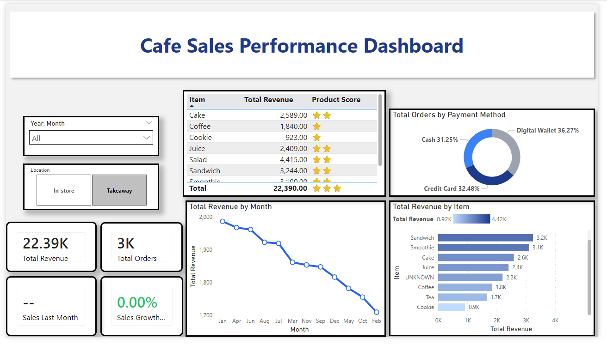
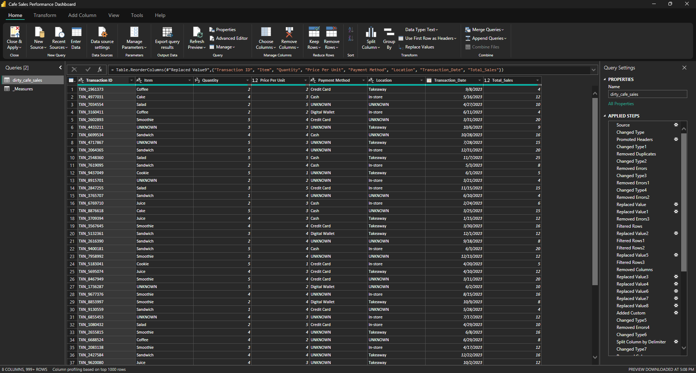
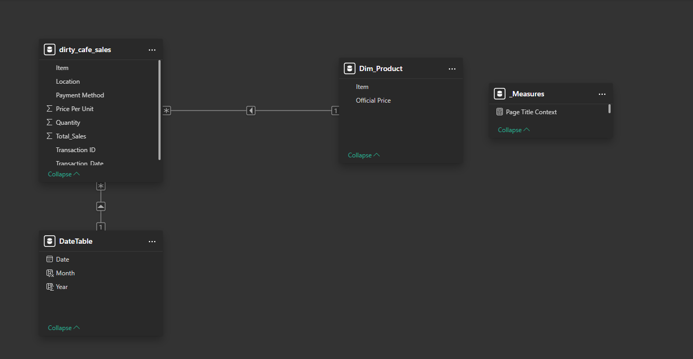
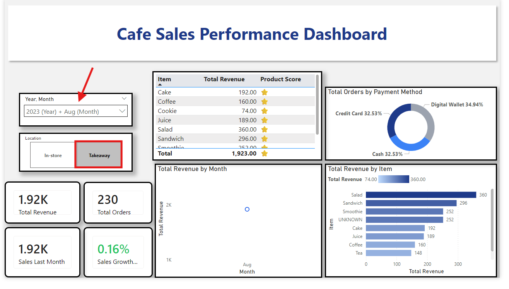
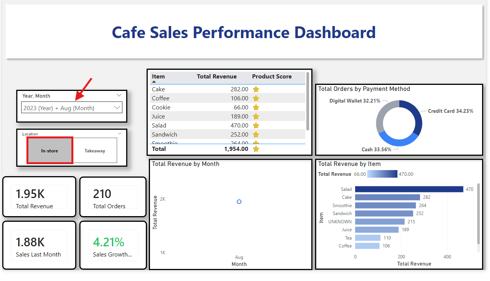

# ☕ Cafe Sales Performance Analysis | Power BI End-to-End Solution

## 📌 Project Overview
This project is an end-to-end **Business Intelligence solution** designed to transform raw, inconsistent cafe transactional data into a highly interactive and insightful Power BI dashboard. 

The primary objective is to solve a real-world business problem: extracting actionable insights from "dirty" data to track key performance indicators (KPIs), optimize profit margins, and understand customer purchasing behaviors.

## 🚀 Business Problem & Solution
* **The Challenge:** The initial dataset (`dirty_cafe_sales.csv`) was unstructured, containing missing values, incorrect data types, and formatting errors (like "ERROR" values in payments), making it impossible to derive accurate financial metrics directly.
* **The Solution:** I developed a complete ETL pipeline and a robust relational data model to clean the data and visualize critical metrics, enabling stakeholders to make data-driven decisions instantly.

## 📊 Dashboard Preview
*(A comprehensive view of the final interactive dashboard)*

## 🧠 Technical Highlights & Methodology

### 1. Data Cleaning & ETL (Power Query)
* **Extraction:** Imported data from raw CSV files.
* **Deep Cleaning:** Handled missing (`null`) and `UNKNOWN` values, corrected pricing anomalies, and handled calculation errors in the "Total Spent" column.
* **Automation:** Integrated a **Python Script** within the Power Query pipeline to automatically export the cleaned dataset to a CSV file for production use.

### 2. Data Modeling (Star Schema)
* **Architecture:** Architected an optimized relational data model connecting the central Fact Table (Transactions) with a dedicated `CalendarTable` dimension.
* **Relationships:** Established a 1:N relationship between the date dimension and transaction facts to support time-intelligence.
* **Organization:** Created a dedicated `Measures Table` to store and manage all DAX calculations efficiently.

### 3. Advanced DAX & Metrics
* **Dynamic KPIs:** Authored optimized DAX measures for Total Revenue, Total Transactions, and Average Order Value.
* **Deep Analytics:** Developed complex calculations for **Profit Margins** and **Sales Contribution**.
* **Trend Analysis:** Implemented Time-Intelligence functions to compare performance across different months and quarters.

### 4. Dashboard Design & Interactivity
* **UI/UX Design:** Crafted a professional, dark-themed layout focused on readability and data storytelling.
* **Dynamic Interaction:** Implemented cross-highlighting and custom tooltips to provide on-hover details without cluttering the main view.

## 💡 Key Insights
* **Top Selling Product:** **Coffee** and **Cake** are the primary revenue drivers.
* **Peak Sales Periods:** Sales peaked during the mid-year period, specifically in **July and August**.
* **Payment Preferences:** **Cash** and **Credit Card** are the most frequently used payment methods, while "Digital Wallet" usage is growing.
* **Operational Efficiency:** Identified and handled over 10% of records that contained errors or missing location data.

## 💻 Tech Stack
* **Tools:** Power BI Desktop
* **Languages:** DAX, Power Query (M), Python (for automated export)
* **Core Concepts:** Data Modeling (Star Schema), ETL Pipeline, Data Visualization, Business Intelligence
